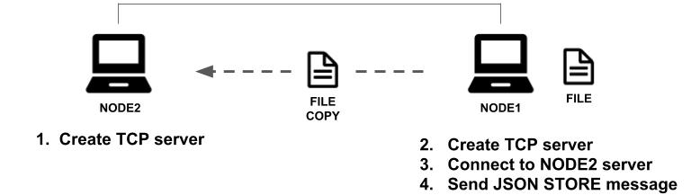

[Layr](https://github.com/layr-team/Layr) is a decentralized (p2p) cloud storage system built atop Kademlia DHT that enforces data integrity, privacy, and availability through proofs of retrievability, redundancy, and encryption, with cryptocurrency-based incentive scheme

---
<h2> Table of Contents </h2>

1. ToC
{:toc}

---
## Preface

This overview is the official case study of the Layr project. Layr is a decentralized cloud 
storage system. Layr is an ongoing, experimental project and we encourage readers to contribute 
on GitHub. This paper will serve not only as a narrative detailing the problems and solutions 
we encountered while building Layr, but as an introduction to the problem space of decentralized cloud storage in general.

---
## Introduction to cloud storage
We upload our data to companies that help us with our cloud storage needs everyday 
(AWS, Dropbox, Google, Apple, etc.). These services are incredibly convenient and 
usually work well, but growing security and data privacy concerns, as well as the costs
associated with these services, have lead others to think about alternatives to 
centralized cloud storage. In response, we built an experimental project called Layr 
that we believe showcases how an alternative cloud storage system can address some of 
the shortcomings in centralized storage systems.

{: .center}
Demo:


### What is cloud storage?
Our minimum working definition for cloud storage is any system that allows a user 
to upload a file, delete it locally, and later download that same file. A well-functioning 
cloud storage system has four additional properties beyond our minimum working definition. 

1. __File ownership:__ Users can only read the contents of files that they own.
2. __On-demand upload/download:__ Users should be able to upload and download files at their discretion.
3. __No data loss:__ A user can retrieve a previously uploaded file without data loss.
4. __Incentives:__ The right incentives are in place between the hosting service provider and the user of the service.

### Centralized cloud storage
Most existing cloud storage services today are what we call centralized services. 
Two familiar examples are Amazon’s S3 and Dropbox. They achieve file ownership for 
their users using server side authentication and provide on-demand upload and download 
through the use of dedicated servers and specialized teams. They prevent data loss 
through a combination of redundancy schemes across their server farms and, again, constant 
maintenance and monitoring of their internal systems. Finally, they have a very clear 
incentive to provide good service: they lose paying customers if their service is poor.

### Critiques of centralized services
While centralized cloud storage is the norm, there are some notable disadvantages. One
major disadvantage is that users must trust storage providers to not view or make use of their
data. Taking a look at centralized services from another angle, we can see that there are
additional disadvantages.

<figure>
  <center>
    
  </center>
</figure>

From the figure above, we can see that many clients rely on a single coordinating host 
node in a centralized system, which can be problematic because this is a system with a single 
point of failure. First, this architecture makes the provider a good target for attack. Second, 
users are trusting storage providers to keep their data private and safe from external parties, but 
users have no authority over the provider’s compliance to these values. Third, we should be 
concerned if the central host goes down, because every client loses access to the service.

Additionally, the distance between nodes varies greatly, which affects the usability of the 
service on the other side of the world due to the additional latency. Let’s explore an alternative 
model: decentralized file storage.

### Decentralized cloud storage
Decentralized networks are composed of independent nodes able to communicate with 
each other. Instead of many clients talking to a single server, each client is also a server, 
capable of sending and responding to requests. 

<figure>
  <center>
    
  </center>
</figure>

Above you can see the distributed or decentralized model has no central node to
facilitate coordination. Additionally, the distances between nodes are more shorter and more 
uniform. If the two systems were mapped on a globe, they might look like this.

<figure>
  <center>
    
  </center>
  <figcaption>
    <small><strong>Centralized system on the left. Decentralized system on the right.
    We’ll explain later on why some of the hops are short and some are longer in a decentralized system later.
    </strong></small>
  </figcaption>
</figure>

Maybe these properties can guide us as we attempt to make an improved cloud file storage
model. Let’s start building a decentralized system to find out more.

---
## Building Layr

### A two-node network
A P2P network is a network of autonomous peers that share a part of their hardware
resources directly with other peers[1]. Let’s start with the simplest version of a peer-to-peer 
(P2P) network: two nodes directly communicating with each other. Since we are building a file 
storage system, the resource peers are sharing is storage space. We’ll build this first iteration 
with simple TCP servers and JSON messaging to transfer files.

<figure>
  <center>
    
  </center>
</figure>

Our Node.js server code takes a callback which defines how it will respond when it receives 
data and the `data` event fires. 

```javascript
const tcpUtils = require('../utils/tcp').tcp;
const fs = require('fs');

class Node {
  createServer(port, host) {
    return tcpUtils.createServer(port, host, this.fileProcessingCallback.bind(this));
  }

  storeFile(fileName) {
    const readStream = fs.createReadStream(fileName);
    const writeStream = fs.createWriteStream(fileName)
    readStream.pipe(writeStream);
  }


  fileProcessingCallback(serverConnection) {
    serverConnection.on('data', (data, error) => {
      const receivedData = JSON.parse(data);

      if (receivedData.messageType === "STORE_FILE") {
        this.storeFile(receivedData.fileName);
      }
    })
  }

  // ...
}

const node2 = new Node();
node2.createServer(1756, '127.0.0.1');
```

The other server `node1` boots up on a different port, connects to `node2`’s current port, and 
writes a JSON message to `node1` telling it to store a file.

```javascript
const node1 = new Node();
node1.createServer(1755, '127.0.0.1');

const clientConnection = node1.connect(1756, '127.0.0.1');
const message = {
  messageType: "STORE_FILE",
  fileName: 'example.txt',
};

clientConnection.write(JSON.stringify(message));
```
Success! We’ve created a working peer-to-peer file storage system because Node1 is 
able to upload a file, delete it, and then request it back from Node2 at a later time. 

Although this system satisfies our minimum working definition of cloud storage, it is not a 
robust cloud storage system. It doesn’t enforce a file owner’s privileged access to the files they 
store on the network, nor is it highly available, resistant to data loss, or provide a clear business 
model for participants.

### File ownership

### Uploading large files

#### Keeping track of shards

### Locating shards and nodes on the network

#### A more sophisticated routing scheme: “closeness”

##### Kademlia RPCs

#### Updated upload and distribution process

##### Additional privacy benefits

### On-demand upload and download

### Enforcing data integrity

### Promoting participation and cooperation

---
## Limitations and Future Steps

### More sophisticated incentive scheme

### Automated patching

### NAT Traversal

---
## Works cited

---
## Our Team

We are all available for new opportunities, feel free to reach out!


