[Layr](https://github.com/layr-team/Layr) is a decentralized (peer-to-peer) cloud
storage system built atop a Kademlia distributed hash table that enforces data
integrity, privacy, and availability through proofs of retrievability, redundancy,
encryption, and a cryptocurrency-based incentive scheme.

If that was at all confusing, don't worry! We unpack all of these concepts below.

---
<h2> Table of Contents </h2>

1. ToC
{:toc}

---
## Preface

This an overview of how we built Layr - a decentralized cloud storage system. We hope that
this overview will serve not only as a narrative detailing the problems and solutions
we encountered while building Layr, but also as an introduction to the problem space of
decentralized cloud storage in general.

Layr is an ongoing, experimental project, and while we encourage readers to read, fork,
or even contribute to the GitHub project, we don't think it's a practical cloud storage
solution at the moment.

---
## Introduction to cloud storage

We upload our data to companies that help us with our cloud storage needs every day
(AWS, Dropbox, Google, Apple, etc.). These services are incredibly convenient and
usually work well, but growing security and data privacy concerns, as well as the costs
associated with these services, have lead others to think about alternatives to
centralized cloud storage. In response, we built an experimental project called Layr
that we believe showcases how an alternative cloud storage system can address some of
the shortcomings in centralized storage systems.

{: .center}
Demo:


### What is cloud storage?

Our minimum working definition for cloud storage is any system that allows a user to
upload a file, delete it locally, and later download that same file. A well-functioning
cloud storage system has four additional properties beyond our minimum working
definition.

1. __File ownership:__ Users can only read the contents of files that they own.
2. __On-demand upload/download:__ Users should be able to upload and download files at
their discretion.
3. __No data loss:__ A user can retrieve a previously uploaded file without
data loss.
4. __Incentives:__ The right incentives are in place between the party storing and hosting
files and the user who wants to store files on the cloud.

### Centralized cloud storage

Most existing cloud storage services today are what we call centralized services.
Two familiar examples are Amazon’s S3 and Dropbox, and here's how they created
strong cloud file storage services.

1. __File ownership:__ Files are protected via server side authentication.
2. __On-demand upload/download:__ Dedicated servers and specialized teams help these
companies achieve high uptime for their storage services.
3. __No data loss:__ They prevent data loss through a combination of redundancy schemes
across their server farms and, again, constant maintenance and monitoring of their
internal systems.
4. __Incentives:__ They have a very clear incentive to provide good service: they lose
paying customers if their service is poor.

### Critiques of centralized services

In a client-server model, clients must rely on a single party’s server or servers to
accomplish a given task over a network, such as retrieve stored data.

<figure>
  <center>
    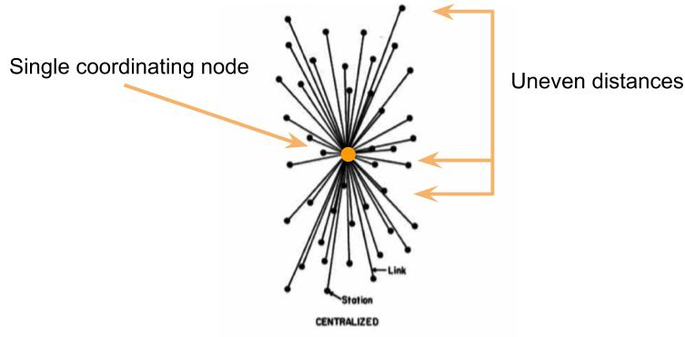
  </center>
</figure>

From the figure above, we can see that many clients rely on a single coordinating host
node in a centralized system in order to communicate. By coordinating host node, we mean
that a central server or servers coordinates requests for centrally stored resources.
While a centralized architecture is the norm in cloud storage, it can have some notable
disadvantages.

1) The first disadvantage of a centralized system is that it can threaten the
confidentiality of user data.

**Internal privacy breaches**: When a user sends a file to a typical centralized
storage provider, they are trusting that the company employees won’t view or make use of
that data.  Additionally, they trust that the company won’t unreasonably share their
data with third parties, such as governments, which are increasingly requesting more
data from providers such as Google [1]. Unfortunately it’s are not possible to
completely ensure that either of these situations won’t arise unless the the system
supports client-side encryption, which we’ll explain and demonstrate later [2].

**External privacy breaches**: Valuable, centrally stored data is a target for external
parties, such as hackers. The attacks on iCloud in 2014 and Dropbox in 2012 are examples
of this type of incident occurring in the cloud storage realm [3][4]. According
to a whitepaper put out by Storj, a company with their own decentralized storage
product, the centralized model is weaker "[b]ecause client-side encryption is
nonstandard, the traditional cloud is vulnerable to a variety of security threats,
including man-in-the-middle attacks, malware, and application flaws that expose private
consumer and corporate data."[5]

2) The second disadvantage to a centralized architecture is that it introduces single
points of failure.

Single points of failure in a system can crop up from employee error, such as case in
2017 when an Amazon S3 engineer crippled almost 150,000 domains for four hours [6].
According to Storj, centralized services are less reliable “because many storage devices
rely on the same infrastructure, failures is correlated across files and systems” [7].

Additionally, the diagram above shows how the distance between nodes can vary. In
practical terms, this means a user who is located far away from where their files are
stored will experience more latency than users located closer to their files.

So let’s explore an alternative model: decentralized file storage.

### Decentralized cloud storage

Decentralized networks are composed of independent nodes able to communicate with each
other. Instead of many clients talking to a single server, each client is also a server,
capable of sending and responding to requests.

<figure>
  <center>
    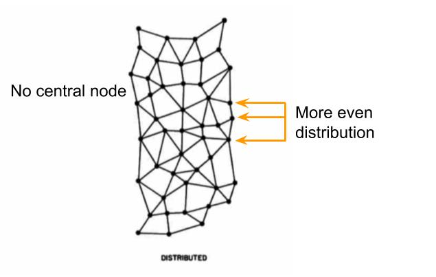
  </center>
</figure>

Above you can see the distributed or decentralized model has no central node to
facilitate coordination, which removes the single point of failure issue. Additionally,
the distances between nodes are more shorter and more uniform. If the two systems were
mapped on a globe, they might look like this.

<figure>
  <center>
    
  </center>
  <figcaption>
    <small><strong>Centralized system on the left. Decentralized system on the right.
    We’ll explain later on why some of the hops are short and some are longer in a decentralized system.
    </strong></small>
  </figcaption>
</figure>

Going forward we’ll be writing about how we made our decentralized storage system, Layr,
satisfy the four criteria we mentioned to create a stronger cloud storage system: file
ownership, on-demand upload/download, no data loss, and incentives.

---
## Building Layr

### A two-node network

A P2P network is a network of autonomous peers that share a part of their hardware
resources directly with other peers [8]. Let’s start with the simplest version of a
peer-to-peer (P2P) network: two nodes directly communicating with each other. Since we
are building a file storage system, the resource peers are sharing is storage space.
We’ll build this first iteration with simple TCP servers and JSON messaging to transfer
files.

<figure>
  <center>
    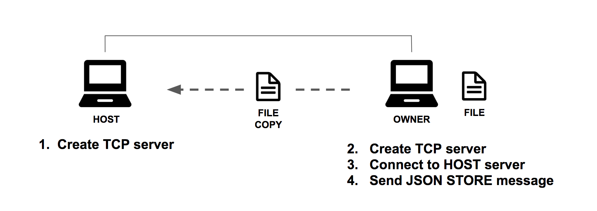
  </center>
</figure>

Our Node.js server code takes a callback which defines how it will respond when it receives
data and the `data` event fires.

```javascript
const tcpUtils = require('../utils/tcp').tcp;
const ports = require('../constants').ports;
const fs = require('fs');

class Node {
  createServer(port, host) {
    return tcpUtils.createServer(port, host, this.fileProcessingCallback.bind(this));
  }

  connect(port, host, callback) {
    return tcpUtils.connect(port, host, callback);
  }

  storeFile(fileName) {
    const readStream = fs.createReadStream(fileName);
    const writeStream = fs.createWriteStream(fileName)
    readStream.pipe(writeStream);
  }

  fileProcessingCallback(serverConnection) {
    serverConnection.on('data', (data, error) => {
      const receivedData = JSON.parse(data);

      if (receivedData.messageType === "STORE_FILE") {
        this.storeFile(receivedData.fileName);
      }
    })
  }

  // ...
}

const host = new Node();
host.createServer(ports.host, '127.0.0.1');
```

The other server trying to store a file on the network, the owner, boots up on a
different port, establishes a connection to the `host`’s port, and writes a JSON message
using the connection to `host` telling it to store a file.

```javascript
const owner = new Node();
owner.createServer(ports.owner, '127.0.0.1');

const clientConnection = owner.connect(ports.server, '127.0.0.1');
const message = {
  messageType: "STORE_FILE",
  fileName: 'example.txt',
};

clientConnection.write(JSON.stringify(message));
```

Success! We’ve created a working peer-to-peer file storage system because the `owner` node is
able to upload a file, delete it, and then request it back from `host` at a later time.

Although this system satisfies our minimum working definition of cloud storage, it is not a
robust cloud storage system. It doesn’t enforce a file owner’s privileged access to the files they
store on the network, nor is it highly available, resistant to data loss, or provide a clear business
model for participants.

### File ownership

The first problem with our naive system is that a file owner’s files are not private: a
file host could easily read the contents of any files they store. To ensure that a file
owner maintains sole read access, we need to figure out how to ensure the files we send
to hosts across our decentralized storage system are completely private to the file
owner. One property that differentiates a file sharing service from a file storage
service is that the files in a storage service are owned by a particular user, and that
user should be the only one who can read the contents of their files. Our first step
towards this goal will be to utilize client-side file encryption.

Client-side encryption is a technique where the file owner uses a pre-generated private
key to encrypt their data before that data is uploaded to the network. Making a secure
key is important, and in our case we use an Advanced Encryption Standard (AES) [10] key
with a length of 256 bits that we create with a random initialization vector [11] of 32
bits.

<figure>
  <center>
    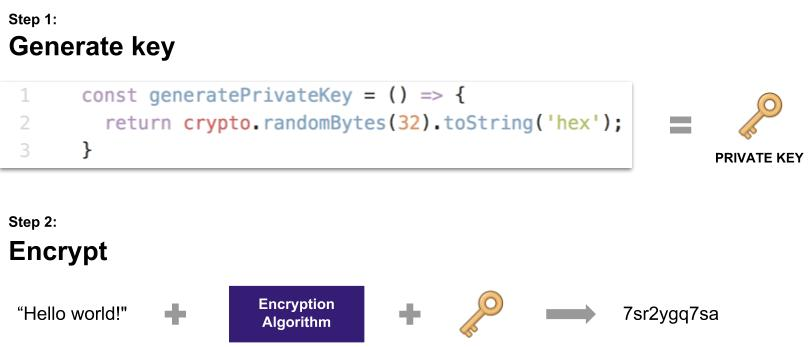
  </center>
</figure>

As long as the user maintains sole access to their private key, they alone have the
power to decrypt the encrypted content. If a user with another keys tries to decrypt the
file’s contents, it will return an unreadable output. Having the encryption happen
client-side and not on the host’s device reduces the risk of tampering.

Symmetric encryption is a particular class of encryption algorithms where the same key
used to encrypt some data is be used to decrypt the same data.

<figure>
  <center>
    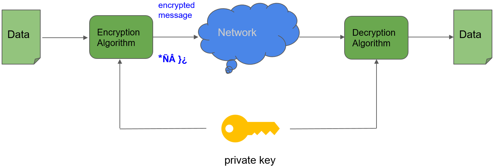
  </center>
  <figcaption>
    <small><strong>Symmetric encryption process</strong></small>
  </figcaption>
</figure>

Another option is asymmetric encryption, which works by using private and public key
pairs to allow multiple parties encrypt and decrypt data from each other [12]. We use
symmetric key encryption because the data owner is the sole participant authorized to
read the contents of files they own.

File owners can now be confident in the privacy of their data with the introduction of
private key encryption. The primary advantage of encrypting data client-side is that the
data doesn’t even enter the network without first being encrypted. Further, the
information required to decrypt the data (the private key) is never shared with other
participants. There is no need to trust file hosts to keep our files safe: they couldn’t
read, share, or sell our information even if they wanted to.

### Uploading large files

Our private file content is now more secure when we send it across the network to
another host, but we have a large problem: large files. If we send a file larger than
the space on our host’s hard drive the upload will fail. Downloading large files is also
burden for file hosts due to the high bandwidth and storage requirements. How do we
solve this space issue? Our answer was to break our files into smaller pieces, a process
called file sharding, and then distribute these sharded files across multiple nodes on
the network.

File sharding involves splitting up files into smaller pieces, which raises some
questions such as, how will we name our new file shards? We guessed that users would
mostly be storing files with unique content, so our strategy to come up with unique file
names was to have the shard’s file name be the hash the file content. If we chose to
split up our files into four pieces, the process might look this.

<figure>
  <center>
    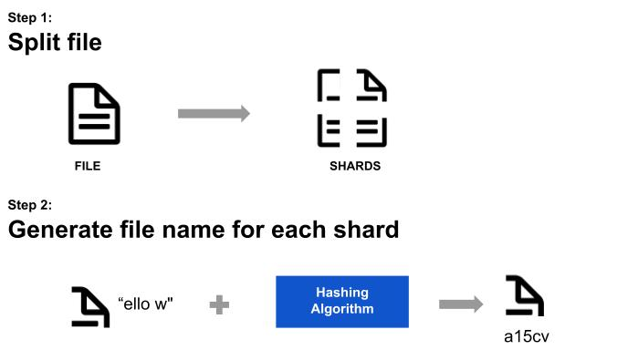
  </center>
  <figcaption>
    <small><strong>File sharding process</strong></small>
  </figcaption>
</figure>

Now that we’ve created file shards with unique names, how do we keep track of these
smaller files? Even if we sent all of these small files to just one host, we wouldn’t be
able to retrieve them again without some system in place to associate them with the
original file. We can create a manifest of the shards created per file upload to solve
this problem for us.

#### Keeping track of shards

With the introduction of file sharding, we’re a step closer to being able to store files
distributed across independent file hosts. Next, we need to solve how to keep track of
the many shards associated with a single file. Inspired by a MIT paper description of
decentralized storage project for keeping track file “chunks” using of a dictionary [13], we
chose to do this by creating a __manifest__ file on file upload. When a user uploads a file
to the network, their file is sharded, shard names are saved to the manifest, and then
those shards are distributed to the network. Here’s what the upload process would look
like with four shards and four hosts.

<figure>
  <center>
    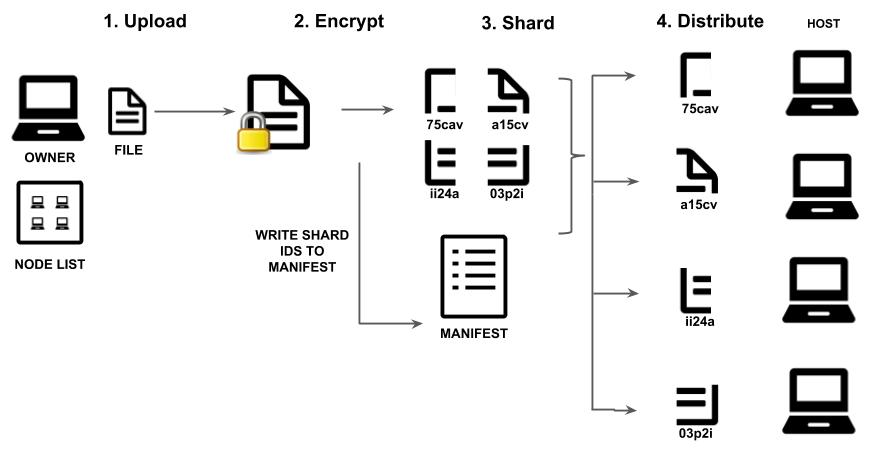
  </center>
  <figcaption>
    <small><strong>The file upload process after manifest files are added</strong></small>
  </figcaption>
</figure>

Here’s what a completed manifest file looks like. Another purpose the manifest file
serves is preserving the order of shards so that the file can be correctly reconstructed
in the future.

```javascript
{
	"fileName": "example.txt.crypt",
	"fileSize": 64,
	"chunks": {
		"5f8f1022ed1f2bc1e8d13b01ceea49d11c1aeb9e",
		"a3442428ddc14ba635c3515b1ffe970c0d67a09d",
		"f02d760b0ad99f6648b4938c58475048ae7e939b",
		"e489be4f23027622b7ab43c969abba32341e8ddf",
		"6c9b2ca42cea34543145fef19c6debe58331bef4",
		"12e190bc3328b39a7f2f575eb4d623982847534f",
		"b4be45e4c27ef521dc772ffd0bd21e80bf9b4ecf"
	}
}
```

The next step is to figure the number of smaller files, or shards, we create from our original file.
We had two choices, each with different advantages.

 1. Constant-shard-count: Create a set number of shards regardless of file size.
 2. Shard-by-file-size: The shard size is set at a maximum, so the number of shards varies based on the file’s size.

The advantage of the constant-shard-count approach was that n early stages of the
development process simpler because we easily tell when something was wrong by counting
the files without having to reference the file’s size. Furthermore, it limited how large
a manifest could grow for larger files. The advantage to shard-by-file-size approach was
that we could guarantee that shard sizes would remain small. Our team chose to start off
with the constant-shard-count approach mainly because it make the development process
easier in the early stages. This is an area that we’re continuing to evaluate and test
as we continue development.

We have a smaller shard files and a way to associate them with a file, but recall that
our goal is to send these shards to multiple different nodes so that we’re able to
upload larger files. That brings up the next challenge, which is how to keep track
shards after we’ve sent them to different nodes. We’ll look at a couple systems for
doing so.

### Locating shards and nodes on the network

Now that our systems contains file shards and a network of nodes, our file upload
process has become more complicated. The core problem is if we randomly distribute our
shards across the network, we currently have no system for retrieving them.

1. Retrievability: As we mentioned if we upload a shard we need to be able find it again
2. Even distribution: We need to figure out a way to more or less evenly distribute the
   nodes across the network because we don’t want to “overload” one node with a large
   number of files until its hard drive becomes full.

The first solution to this problem was to maintain a full list of all node contact
information for the uploading node to use. As the file owner uploads each successive
shard, the owner will need to reference a complete list of nodes in order to send the a
new host another shard for that file. For each upload, we would record the node and host
pair’s data in the in the manifest.

<figure>
  <center>
    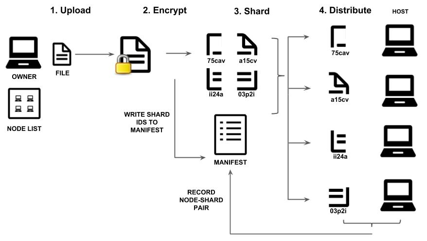
  </center>
  <figcaption>
    <small><strong>File upload process where each node maintains a "master list" of other nodes</strong></small>
  </figcaption>
</figure>

This works ok, but won’t work well as our network grows in size for a couple reasons:

- All nodes are potential uploaders. Therefore each node needs to hold its own complete
  node list.
- Difficult to maintain consistency. Each of these individual lists would need to be
  updated whenever a node left or joined the network to maintain a consist
  representation of the network’s state.
- List bloat. A large _n_ of nodes will make our node list grow too large to be handled
  efficiently. What if we have millions or billions of nodes on our network? An O(n)
  space complexity for our node routing list will not work well in that case.

Since this approach won't scale, we'll instead need to devise another more efficient
method to locate shards on the network.

#### A more sophisticated routing scheme: “closeness”

We now know that unfortunately we can’t maintain giant, comprehensive lists of all nodes
on our network. To come up with an a better solution to this problem, let's step away
from the world of nodes and files, let’s think about another type of network: human
social networks.

There are many people in the world, and if we want to locate one person in particular
who isn't near us, we thankfully can do so without needing to know the contact
information of everyone else in the world. One way to find another person is through our
personal contacts, which is the basis for the following example.

Let’s imagine at a somewhat contrived situation where we the best way to reach another
person that we don’t know ourselves is to contact people we do know who are
geographically closer to the person we’re trying to reach. Here’s how someone named
Alice in San Francisco, California might iteratively search through her contacts, and
contact’s contacts, for someone named Bob in New York, New York. Each time she relies on
the geographically closest contact to Bob to query their respective list of contacts for
geographically closer contacts, and so on.

<figure>
  <center>
    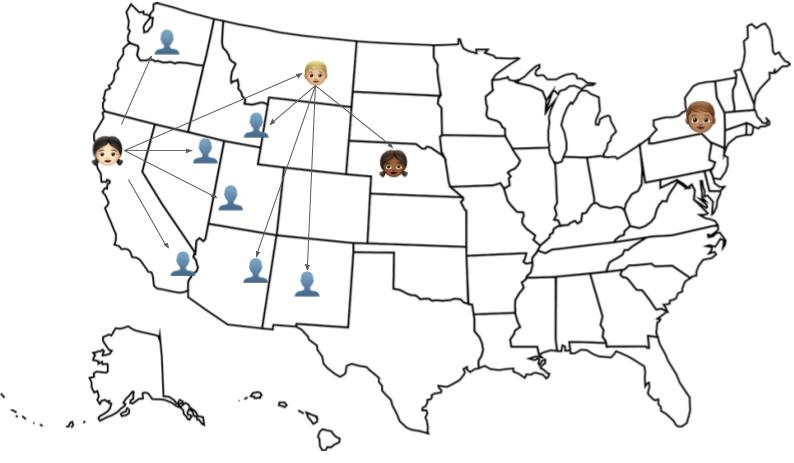
  </center>
  <figcaption>
    <small><strong>Using increasingly geographically closer contacts to find a person</strong></small>
  </figcaption>
</figure>

Let’s go back to thinking about the problem of one node needing to upload a file to
another node. The method we use will need to:

1) Be repeatable: We want to use the same process to find the shard when we download it
later
2) Not require a full list of nodes: We previously described why we can't use this
approach.

The method we’ll use to decide the node-shard relationship will be a type of
__logical closeness__: the node id “closest” to the file id will be the node to host the
file.

We used Kademlia, a distributed hash table (DHT) [14], which is a set of data structures
and protocols that allows us to find nodes, store values, and retrieve values across the
network. Kademlia incorporates logical closeness to provide efficient routing and
communication protocols between nodes. Examples of Kademlia in use are BitTorrent [15]
and Ethereum [16]. The Kademlia protocols and structure is complex, and implementing it
was not the goal of our project, so use a library Kadence [17] based on Kademlia as our
node communication layer.

If you would like to read more about Kademlia, we encourage you to visit to look into
some of the resources linked here [18][19].

#### Updated upload and distribution process

Now that we are using Kademlia via Kadence as a tool to manage shard upload and
retrieval, our system for distributing a shard has gotten a bit more complex, so we’ll
go over that next.

Due to the increasing complexity of our system, we have refactored our LayrNode code to
contain two “sub-nodes” that manage different responsibilities:

- FileNode: File processing, encryption, managing manifest, personal, and hosted files
- KadNode: Node-to-node communication

Here is the updated process for distributing a shard to network.

<figure>
  <center>
    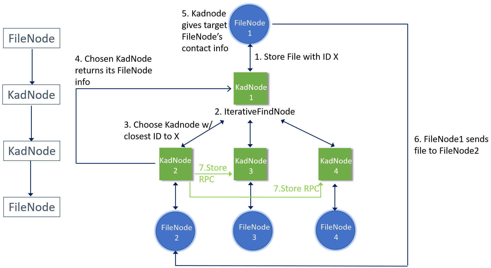
  </center>
</figure>

To allow KadNodes to find the contact information of another KadNode’s FileNode, we
effectively extended the Kademlia RPCs by adding FILENODE.

```javascript
module.exports.kadFilePlugin = function(node) {

  node.use('FILENODE', (req, res, next) => {
    let contact = node.fileNode.address
    if (node.fileNode.server){
      res.send(contact);
    } else {
      res.send(['false'])
    }
  });

  node.getOtherfileNodeContact = function(targetNode, callback) {
    let filecontact = node.fileNode.address
    node.send('FILENODE', batcontact, targetNode, callback); // batcontact is an object, targetNode is a contact tuple from a bucket
  };

};
```

One thing to note about using Kademlia is we can’t guarantee each shard will go to a
distinct node. However if there are a sizeable number of nodes on the network, each one
node id exists on a 160 bit keyspace so the likelihood of one node hosting all file
shards is relatively low.

Our upload process for an entire file’s shards now looks like the diagram below.

<figure>
  <center>
    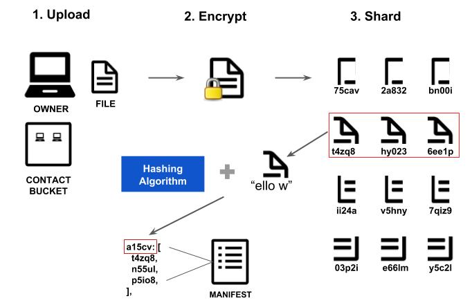
  </center>
  <figcaption>
    <small><strong>Redundant upload process</strong></small>
  </figcaption>
</figure>

---
#### Additional privacy benefits
Now that we’re able to upload a file to multiple file shards across multiple nodes our files are more private than they were before. Previously, if a host gained access to to user’s private key the whole file’s privacy would be instantly compromised. Now, even if the host gains access to the key they will only have access to a small part of the file’s data. In terms of data privacy, our system is theoretically much stronger than a centralized storage systems’.

Although file owners can now upload large files, they can not necessarily retrieve their files when they want to, which is a major limitation.

### On-demand upload and download
To ensure that owners can download uploaded files on-demand, we will need to make sure that each shard’s data is generally available for retrieval. Each individual shard is stored on a single host node, and since we can neither guarantee that the host will be online nor that it won’t modify or delete the data, the system cannot guarantee that all file shards will be available at a given point in time.

<figure>
  <center>
    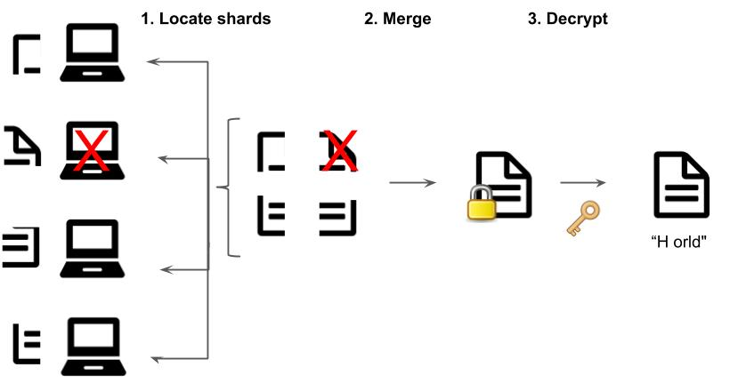
  </center>
</figure>

If we can decouple the status of any single storage provider and the availability of the files it is storing, we’ll have a more resilient file storage system. Having a single host hold each unique shard seems to be an issue, so we’ll take advantage of the additional nodes on the network by using them to store redundant shards copies. This general approach is called a
__redundancy scheme__.

During our research, we came across two redundancy schemes used by many people. The first is called
__mirroring__ and the second is __erasure coding__. Erasure coding introduces “wildcard”, or encoded, shards that can “substitute” in for any lost shard, which decreases the probability of losing access to a file. This a more advanced technique that even larger entities such as Storj had not implemented until recently[9]. We therefore opted to use mirroring, which is simply the distribution of multiple full copies of a file.

Given a single file, if a file owner is using mirroring, then they will upload complete copies of that file to multiple hosts. If one host’s hardware fails, or if a host deletes the data, another host has that file intact.

In terms of implementing mirroring in our system, the first problem to solve is how to reduce the likelihood that redundant shards will be sent to the same hosts node. Remember that when we distribute a shard to the network, the shard is sent to the node with the closest id to the shard’s id. Therefore if each redundant shard has the same id, there’s a high probability all shards will be sent to the same node.

<figure>
  <center>
    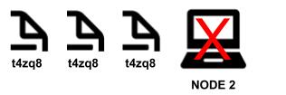
  </center>
  <figcaption>
    <small><strong>This is not a useful application of a redundancy scheme
    </strong></small>
  </figcaption>
</figure>

To solve this issue, we’ll need to generate unique shard file names. We do this by adding additional bytes of random data when generating a redundant shard file name. Now when we go to distribute our redundant shards across the network, we’ll get a more even distribution of nodes and consequently a better chance of having our file be generally available for download.

<figure>
  <center>
    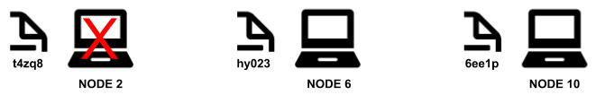
  </center>
</figure>

The second problem to solve is how to organize the redundant shards with each other in the manifest. The way we organize in the manifest is as an array of values under a key which is the hash of the shard’s content. Below is a diagram demonstrating how a group of redundant shards would be organized in the manifest file during the upload process under the shard’s content hash `a15cv`.

<figure>
  <center>
    
  </center>
</figure>

### Enforcing data integrity
A redundancy scheme eliminates the single point of failure for a shard, but unfortunately it does not ensure that a file will be generally available to its owner for download. This is due to the fact that a peer to peer network is a low-to-no-trust environment - we can neither guarantee that the host holding shard will be online nor that it will preserve the shard’s contents. We therefore need a way to maintain a baseline level of redundancy on the network as time passes by responding to decreases in file redundancy.

In order to respond to decreases in redundancy we first need to give file owners the ability to first detect decreases. File owners need a method to test whether the shards for their file on the network is available and unmodified.

#### Proofs of Retrievability

A proof of retrievability is, in its simplest sense, a procedure that tests whether a file is retrievable from a data host. A retrievable file is one whose original contents can be extracted from the data host supposedly storing that file. One important piece information that proofs of retrievability, or audits, can provide is how whether a given shard has fallen below the system baseline redundancy level for shards. We set the baseline redundancy level to three redundant copies because this was previo the default value for Storj and Sia.[10][11]   

The current literature shows that an ideal Proof of Retrievability (PoR) has the following properties:

1. Reliable results: the host should not be able to verify the retrievability of the shard unless the shard is available and unmodified .
2. Low storage burden for the file host and owner.
3. Low computational and communication overhead for the data host and data owner.
4. Unlimited audits: the number of proofs of retrievability that can be issued on the data should be unbounded.

Given the time we had, we did not find a technique that met all four requirements. Security was the most important requirement, so we began by re-downloading the shard from the host to see if it matched the local shard on the owner’s device.

<figure>
  <center>
    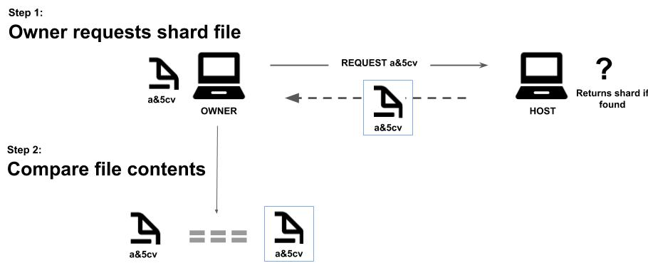
  </center>
</figure>

The first and largest problem with this approach is it requires the file owner to keep a local copy of the shard file so that the contents of each file could be compared in the first place. This violates our core definition of cloud storage, which specifies that a user must be able to delete the file upon uploading it to the network. The second problem is the high communication overhead: the data host has to send the entirety of the file data every time the data owner performs an audit.

We’ve now learned we need a way to check if the file has been modified without retrieving or storing the file data. One option would be to just ask for the hash of the file we are auditing. This eliminates the need to store the file, since we  only need to store the file’s hash, which is already stored in the manifest. Although this strategy allows the file owner to delete their file after uploading it, minimize communication overhead, use infinite number of audits, and doesn’t require storing any information on the file host that we were not already storing, it has one fatal flaw: the data host can cheat an audit by storing the hash of the original file’s content rather than storing the file itself.

<figure>
  <center>
    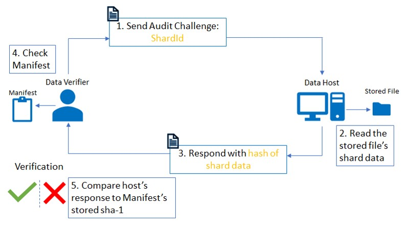
  </center>
  <figcaption>
    <small><strong>Data owner/verifier (left) requests the hash of the file with specified ID from the host (right).
    The host reads and hashes the file and returns it to the data owner. The data owner checks the hash against the one
    stored in the manifest file to verify the host's answer.
    </strong></small>
  </figcaption>
</figure>

Using the hash of the file’s contents is a step in the right direction, and it clearly brings about some benefits, especially by way of reducing communication overhead. However, we can use a modified version of this hash-based verification method which provides much higher confidence in the result of the audit while still keeping communication overhead low. That is, instead of simply asking for the hash of the file’s contents, which would allow the host to store the hash ahead of time, we can ask for the hash of the file’s contents plus a randomly generated challenge string. The host is unaware of the challenge string prior to audit, so they cannot pre-store the hash value of file data + challenge string. To ensure that the host can never pre-store an answer, the owner can never reuse a challenge string.

If the data owner cannot reuse challenge strings, and if the data owner needs to be able to verify the host’s response by storing the correct hash value of the file data + challenge string, how can the data owner know the correct answer without holding onto the file they uploaded? Recall that our definition of cloud storage requires that the data owner be able to delete their files after uploading them. The way to do this is to pre-generate a series of challenges and the correct responses to those challenges.

```javascript
{
  <shardId>: {
    <challenge>:<hashOfChallengeAndShardData>,
    <challenge>:<hashOfChallengeAndShardData>,
    <challenge>:<hashOfChallengeAndShardData>
  },
  <shardId>: {
    <challenge>:<hashOfChallengeAndShardData>,
    <challenge>:<hashOfChallengeAndShardData>,
    <challenge>:<hashOfChallengeAndShardData>
  }
}
```

The limitation of this approach is that there is an upper-bound placed on the number of audits a file owner can perform. Once the challenges run out, they need to re-download and re-upload their file. Further, the fact that these challenges and answers can only be used once also means that this auditing system’s storage requirement grows linearly with the number of audits a data owner will want to perform before re-downloading and re-uploading their file. Finally, generating these challenge strings and answers adds extra preprocessing during upload.

Proofs of retrievability is an ongoing area of research and the literature is replete with sophisticated methods, all with their various tradeoffs between performance metrics and security. We continue to explore alternatives in depth as we strengthen and optimize the Layr network.

#### Patching
Proofs of retrievability communicate the state of remotely stored data, but do not fix data that has been compromised. Next we need to empower a file owner to easily fix instances when a shard’s redundancy across the network decreases because of data corruption or loss.

If an audit reveals that a shard is unretrievable on the network, the easiest solution is to simply re-upload that shard. Our specification of cloud storage allows file owners to delete their files locally, so this solution is untenable But if the network holds another copy of that shard on the network, and that copy is retrievable, then the file owner can use that copy to generate a new copy, effectively replacing the corrupted shard with an uncorrupted copy.

It's important to note that all redundant copies of a shard need to fail their audits in order for the file to be unretrievable.

The current Layr implementation uses file patching for shards, as described above. The result of a file patch is that a new copy of a shard for each unretrievable copy is generated and distributed to the network, assuming there is a least one retrievable copy on the network to begin with. The old copies, unretrievable copies are also removed from the manifest and replaced with the new copies. If no shard copies exist on the network for a given piece of shard content, then the file owner will need to upload the file to the network once again.

<figure>
  <center>
    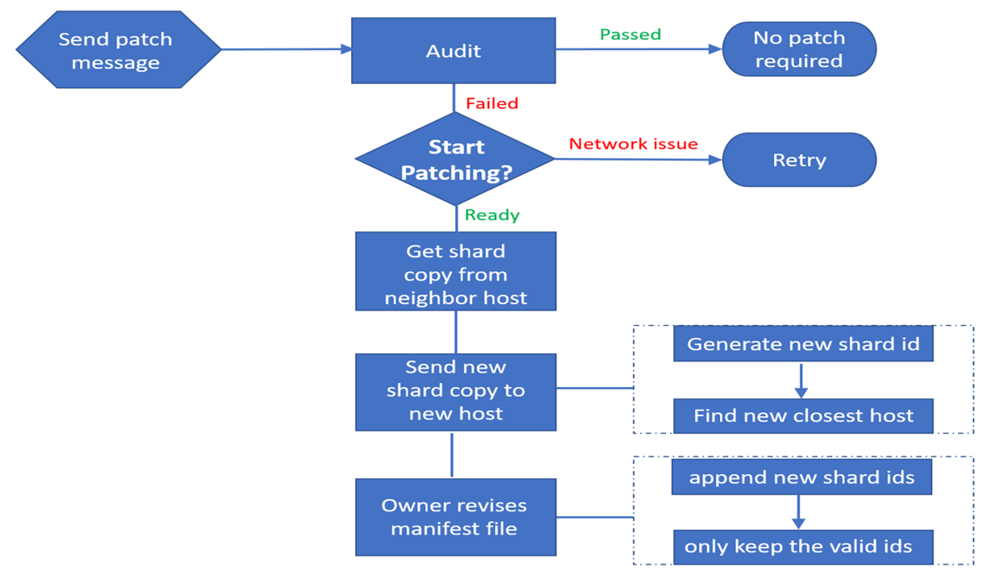
  </center>
  <figcaption>
    <small><strong>The patch method takes a manifest file path as an argument and runs an audit on all the shards
    in that manifest. If every audit passed, then no patching is required. However, if an audit fails for a specific
    shard, then an existing, yet retrievable copy is downloaded from the network and stored on a new host.
    The manifest file is then updated.
    </strong></small>
  </figcaption>
</figure>

### Promoting participation and cooperation
Thus far, we’ve discussed how the Layr network implements solutions to technical concerns like data loss and data privacy, but we have not introduced a way to solve our “people problem”. There is still a burning question: Why would people participate in the first place? Sure, participants who wish to store data have a strong incentive to join the network, but what about people who have free storage space on their devices? We need hosts to participate as well, since this increases the available storage in the network for data owners looking to store their data, as well as increases the amount of independent providers, allowing for better distribution across more storage providers.

When thinking about strategies to incentivize a group of users behaviors, we need to think about two topics:

1. Strength of motivation: What will truly motivate peers to commit time and hardware to help other peers?
2. Qualities of our system: What constraints does a decentralized storage have that would limit our menu of options?

Relying on generosity or even points does not seem like a realistic motivator as storage space have bandwidth and hardware costs. Our next option is compensation as many decentralized systems, just like centralized systems, financially compensate the storage provider. However,  a decentralized system  is built upon the principles of privacy, anonymity, and distributed points of failure, so it does not make sense to use a centralized provider for users to transact with each other, such as PayPal, Venmo, Google Wallet, etc. A system which is potentially anonymous and decentralized like Layr is Filecoin’s storage-as-value concept, but this system has additional complications and limitations such as preventing potential uploaders from uploading unless they first hosted data on the network. When we consider the strategies that are strong, fit within our system, and are not overly complex, it turns out using cryptocurrency based payments is the strongest solution.

<figure>
  <center>
    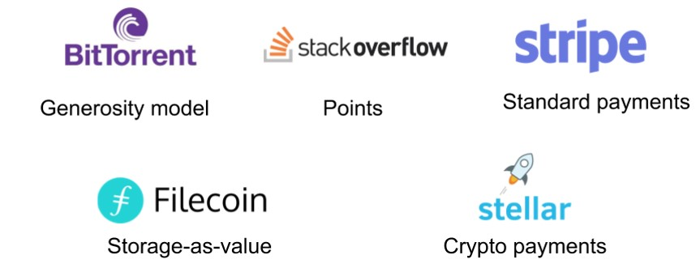
  </center>
  <figcaption>
    <small><strong>The list of incentive models and examples we considered
    </strong></small>
  </figcaption>
</figure>

The Stellar network is a good choice here because of its robust JavaScript SDK,  extremely low transaction fees, and TestNet, which allows us to spin up test wallets that acted just like genuine wallets on the standard network. Further, each test wallet is funded with 10,000 native tokens, called Lumens.

#### Choosing an incentive scheme
Let’s start with the simplest incentive scheme we can imagine: pay-by-upload. In a pay-by-upload incentive scheme, file owners pay data hosts during the upload process.

Let’s examine pay-before-upload as an initial implementation strategy. In a pay-before-upload model, the file owner sends a payment to a target host before sending the file to the target hose. The target host then confirms receipt of payment, at which point the file owner can transfer their file to the host.

There’s a huge problem with this model. Payment and file data transfer are separate operations, and there is no guarantee that the data will make it to the data host after the data owner issues their payment. This could be due to the inherent volatility of network communication, as well as more malicious causes such as the data host disconnecting after receiving payment.

<figure>
  <center>
    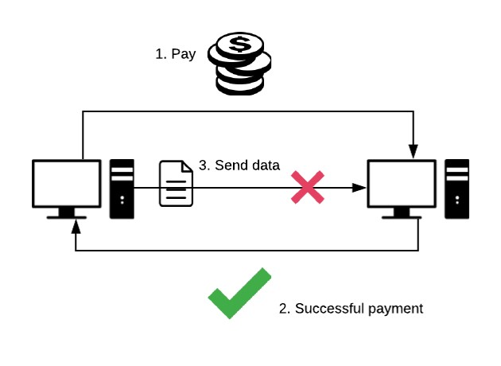
  </center>
  <figcaption>
    <small><strong>
    </strong></small>
  </figcaption>
</figure>

Perhaps a pay-by-after scheme would solve this problem. Instead of sending the payment prior to sending the data, let’s just send the data over and then send the payment over. This way, the data owner only pays after they know the data has arrived to the host node, and if the data owner decides not to pay, the host node can just delete the data.

Some immediate questions this approach raises are: how long should the host node wait until it deletes the data owner’s file? What if the data owner’s payment arrives late due to uncontrollable latency? The main problem here is that the data host doesn’t know whether it’s getting paid or not, so it has to wait. The longer the data host waits, the more hardware resources they have sacrificed. The shorter the data host waits, the more likely they are going to delete the data owner’s file after the payment has been initiated but before it has appeared in the data host’s account. Therefore, which ever way we go - more wait-time or less wait-time - the likelihood of one party receiving the short end of the bargain increases. t seems like the ideal solution would be if Layr implemented a constraint such that possession of the file was necessary for payment to occur in the first place.

<figure>
  <center>
    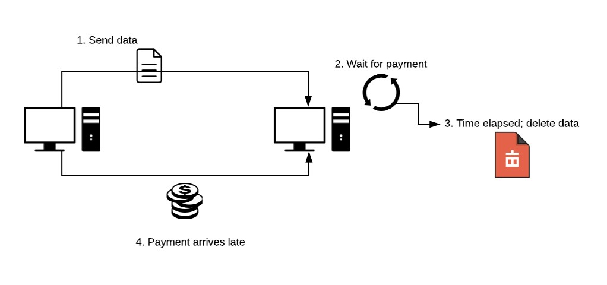
  </center>
  <figcaption>
    <small><strong>
    </strong></small>
  </figcaption>
</figure>

#### Batching payment and data transfer
So, how can we impose a constraint on payment that makes the presence of the file necessary for payment to occur? Similar to the way in which unlocking a door entails the possession of a key for that lock, perhaps we can lock the payment in a “box” for which the file data itself is the key. We can do that with the introduction of smart contracts. Smart contracts offer a programmatic way to impose a set of constraints on a transaction, such that a transaction will only be successful if all these constraints are respected.

For example, say I wanted to hire you to do some work on my house, but I didn’t want to pay you for the work before you did it, since I suspect you’ll just run off with the money. Similarly, you don’t want to do the work before getting paid, because you suspect I’ll avoid paying you after the work is done. So, we both agree to a set of criteria that the work on the house must meet, as well as a price that I’ll pay you if those criteria are met. We have an attorney draw up a contract formalizing this agreement, we both sign, and now neither of us need to enforce compliance because a third-party attorney is doing it for us. Once you finish your work on my house, you submit proof that your work meets the specifications of our agreement, and the attorney releases the funds.

We can accomplish the same thing with a smart contract instead of an attorney. A smart contract in this situation can programmatically enforce our agreement by executing only when we have both signed and when your proof has been submitted. The contract would then execute, check your proof, pay you if the proof passes or refund me if your proof fails

Applying this to data storage, a smart contract should, first and foremost, ensure that the data host only gets paid once they submit proof that they have received the correct data. Further, proof and payment should be atomic such that if the proof succeeds, it is guaranteed that the payment will succeed, and if the proof fails, it is guaranteed that the payment will fail.

1. __Create contract and deposit funds__: The file owner creates the smart contract for our pay-by-upload incentive scheme and sends it to the Stellar network.
2. __Store target shard hash__: The file owner generates a hash of the file’s contents.
3. __Lock the funds with hash__: Once the data is hashed, the hash itself is added as a signer to this account. This prevents the funds from being accessed by anyone without the file data. We use the hash of the data, not the data itself, to lock the funds because this contract, and its signers, are stored on the public blockchain.
4. __Send data__: The file owner sends the shard file and public ID of contract to the host.
5. __Host unlocks funds__: The host uses the file data (not the hash) to attempt to unlock the funds from the account, which is only possible if the host receives the correct information.

Note that we use the hash to unlock the funds in the contract: the preimage used to
__generate__ that hash is (i.e. the raw file data itself). Therefore, the file host needs to possess the file data upon signing the contract , since pre-generating a hash of the file data would not work. This is important because it guarantees that the host has the data at the time of receiving payment. Imagine if the host could unlock the funds with the hash of the file data: the host could then generate the hash, delete the data, and then use the pre-generated hash to get paid. This would mean that proof of data possession and payment were not truly coupled together.

<figure>
  <center>
    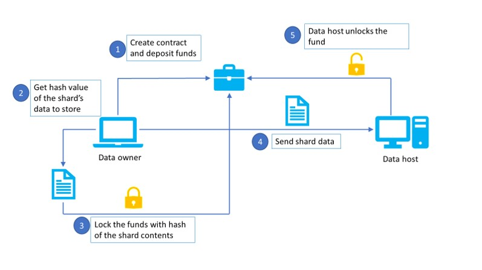
  </center>
  <figcaption>
    <small><strong>
    Data owner (left) draws up a contract and deposit funds to the contract. Data owner then locks those funds with a hash of the file contents it will send to the data host (right). Data owner sends file data plus contact information. The host then uses the file data to unlock the funds in the contract.
    </strong></small>
  </figcaption>
</figure>

The advantages that this method has over pay-after-upload is that this method ensures
that payment to data host implies that the file data is present on the data host’s
machine __at the time of payment__. The data owner does not have to worry about paying
for storing data that never even made it to the host, or that was deleted before the
payment even went through.

---
## Limitations and Future Steps

### More sophisticated incentive scheme

Although our pay-by-upload approach encourages hosts to participate in the network, it does not encourage cooperation over time. A file host cannot get paid without proving that they possess the correct data, but there is nothing stopping them from deleting the data after they’ve been paid. So, although we’ve made payments and proof of data possession atomic, there is no incentive for hosts to continue to store data over time. That is why we are working on implementing a pay-by-successful-audit incentive scheme. If we think about what file owners want out of the system, it’s available storage over time, not just immediate storage.

### Automated patching

At present, a user storing a file on the network needs run a manual patch every so often. This is not very convenient for users, so we plan on exploring automation options in this area in the future.

### NAT Traversal

Layr nodes are only able to communicate with other Layr nodes that have an openly addressable IP location on the internet. In other words, if a peer node has a private IP address because it is behind a NAT router, it will not be able to effectively communicate on the network. What this means in practical terms is, servers on hosted services like Digital Ocean or Amazon EC2 work with Layr but your personal devices at home often do not. While our team did not have time to implement any of the NAT strategies we researched, we plan to introduce one or more into the project in the future.

---
## Works cited

1. https://www.cnet.com/news/google-reports-all-time-high-of-government-data-requests
2. https://www.ll.mit.edu/mission/cybersec/publications/publication-files/full_papers/2016_Itkis_TR-1210.pdf
3. https://www.ibtimes.co.uk/icloud-accounts-risk-brute-force-attack-hacker-exploits-painfully-obvious-password-flaw-1481623
4. https://www.theguardian.com/technology/2016/aug/31/dropbox-hack-passwords-68m-data-breach
5. https://storj.io/storj.pdf, pg. 2
6. https://www.usatoday.com/story/tech/news/2017/02/28/amazons-cloud-service-goes-down-sites-scramble/98530914/
7. https://storj.io/storj.pdf, pg. 2
7. https://www.computer.org/csdl/proceedings/p2p/2001/1503/00/15030101.pdf, pg. 1
8. https://nodejs.org/en/docs/guides/blocking-vs-non-blocking/
9. https://en.wikipedia.org/wiki/Advanced_Encryption_Standard
10. https://en.wikipedia.org/wiki/Block_cipher_mode_of_operation#Initialization_vector_(IV)
11. https://hackernoon.com/symmetric-and-asymmetric-encryption-5122f9ec65b1
12. https://courses.csail.mit.edu/6.857/2014/files/14-pantawongdecha-tromba-voss-wang-blackbox.pdf, pg. 10
13. https://pdos.csail.mit.edu/~petar/papers/maymounkov-kademlia-lncs.pdf
14. http://www.bittorrent.org/beps/bep_0005.html
15. https://github.com/ethereum/wiki/wiki/Kademlia-Peer-Selection
16. https://kadence.github.io/index.html
17. https://xorro-p2p.github.io/resources/
18. https://tams.informatik.uni-hamburg.de/lehre/2004ss/vorlesung/medientechnik/material/kpres.pdf
19. https://www.ll.mit.edu/mission/cybersec/publications/publication-files/full_papers/2016_Itkis_TR-1210.pdf, pg. 24
20. https://storj.io/storj.pdf, pg. 12
21. https://storj.io/storj.pdf, pg. 12
22. https://www.reddit.com/r/storj/comments/6yw2x5/only_3_nodes_per_file/
23. https://storj.io/storj.pdf, pg. 4

---
## Our Team

We are all available for new opportunities, feel free to reach out!


